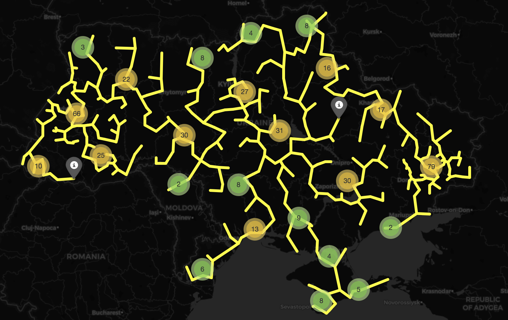

# Bulding roads in the Ukraine!
The aim of this project was to connect the most populated cities in Ukraine via roads. 

```
## How?
* scraping wiki article about cities in Ukraine to get the list of names
* through geocoder, recieve coordinates of each city in Ukraine
* calculate the distances between each city in collection
* write a bunch of algorithms finding minimum spanning tree in a graph
* visualize the MST and compare resulting distances with resulting ones
```
## Algorithms
I wrote a few different algorithms for solving MST task. The list of them:
* [Kruskal's](https://en.wikipedia.org/wiki/Kruskal%27s_algorithm)
* [Boruvka's](https://en.wikipedia.org/wiki/Bor%C5%AFvka%27s_algorithm)
* [Prim's](https://en.wikipedia.org/wiki/Prim%27s_algorithm)
```

